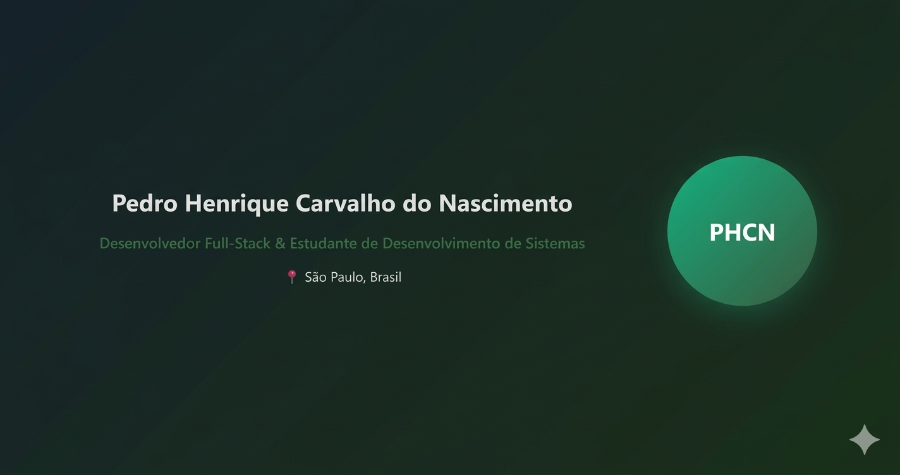

# 🌐 Personal Portfolio

This is my personal developer portfolio built to showcase my projects, skills, and experience as a software developer.

🔗 Live Website: https://portfoliophcn.vercel.app/

The goal of this project is to create a modern, responsive, and interactive platform where visitors can learn more about me, explore my projects, and get in touch.

---

# 🚀 Features

- Modern and responsive UI
- Smooth navigation between sections
- Projects showcase
- Skills and technologies section
- Contact section for communication
- Optimized for desktop and mobile devices

---

# 🧑‍💻 About the Project

This portfolio was designed to represent my journey as a developer and highlight the projects I have built.

The website focuses on:

- Clean design
- Good user experience
- Simple navigation
- Clear presentation of projects and skills

It serves as a central hub where recruiters, developers, and collaborators can learn more about my work.

---

# 🛠 Technologies Used

The project was built using modern web development technologies such as:

- HTML
- CSS
- JavaScript
- React / Next.js
- Tailwind CSS
- Vercel (deployment)

---

# 📂 Sections

### Home
Introduction and quick presentation.

### About
Information about my background, interests, and journey in software development.

### Projects
A collection of projects I have worked on, demonstrating my technical abilities and problem-solving skills.

### Skills
Technologies and tools I use for development.

### Contact
Ways to get in touch with me.

---

# 📸 Preview



---

# 📦 Installation

If you want to run this project locally:

```bash
git clone https://github.com/yourusername/portfolio
cd portfolio
npm install
npm run dev
